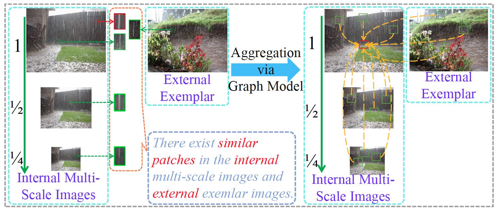
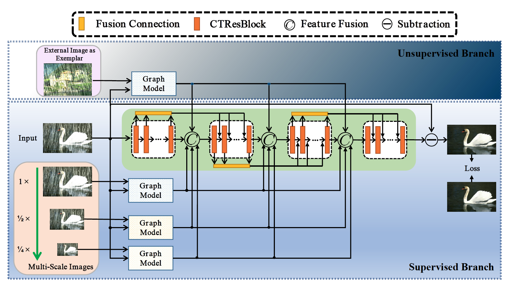
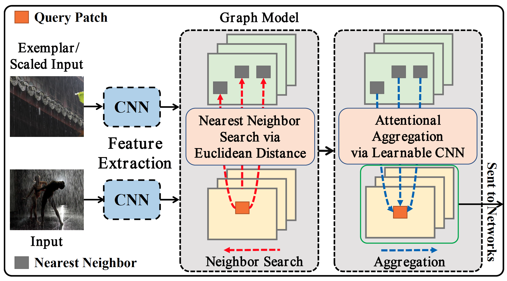
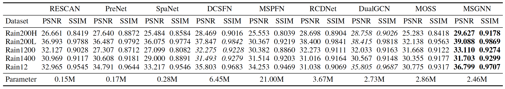
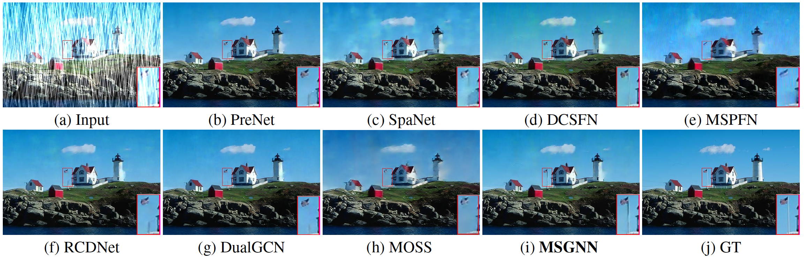

# MSGNN [IJCAI-24]

This is the official PyTorch codes for the paper  
[Explore Internal and External Similarity for Single Image Deraining with Graph Neural Networks](figs/IJCAI24-MSGNN.pdf)

[Cong Wang](https://scholar.google.com/citations?user=0DrHHRwAAAAJ&hl=zh-CN), Wei Wang, Chengjin Yu, Jie Mu

## Abstract
```
Patch-level non-local self-similarity is an important property of natural images. 
However, most existing methods do not consider this property into neural networks for image deraining, thus affecting recovery performance. 
Motivated by this property, we find that there exists significant patch recurrence property of a rainy image, that is, similar patches tend to recur many times in one image and its multi-scale images and external images. 
To better model this property for image detaining, we develop a multi-scale graph network with exemplars, called MSGNN, 
that contains two branches: 1) internal data-based supervised branch is used to model the internal relations of similar patches from the rainy image itself and its multi-scale images and 2) external data-participated unsupervised branch is used to model the external relations of the similar patches in the rainy image and exemplar. 
Specifically, we construct a graph model by searching the k-nearest neighboring patches from both the rainy images in a multi-scale framework and the exemplar. 
After obtaining the corresponding k neighboring patches from the multi-scale images and exemplar, we build a graph and aggregate them in an attentional manner so that the graph can provide more information from similar patches for image deraining. 
We embed the proposed graph in a deep neural network and train it in an end-to-end manner. Extensive experiments demonstrate that the proposed algorithm performs favorably against eight state-of-the-art methods on five public synthetic datasets and one real-world dataset.
```

## Motivation
```
There exists significant patch recurrence property of a rainy image, that is, similar patches tend to recur many times in one image and its multi-scale images and external images.
```


## Overall of MSGNN
```
Our method consists of two branches: an internal data-based supervised branch and an external data-participated unsupervised branch. 
In the supervised branch, we explore the internal property of multi-scale images by reasoning the multi-scale patch correlations to help the original-scale image learn more internal image information. 
In the unsupervised branch, we build the external patch correlations between input images and another external image as an exemplar by utilizing the superiority of the graph network which can search similar patches between any two samples so that the network is able to learn more rainy conditions for better rain
removal.
```


## Graph Model
```
Our graph model exploits both internal and external non-local similarity. 
Internal non-local similarity is utilized to identify similar patches to the query patch within the input image of different scales. 
The external non-local similarity is to find similar patches from another rainy image, the external exemplar.
```


## Results


### Visual comparisons on the synthetic dataset


### Visual comparisons on the real-world dataset


## Installment dependency

1 Create conda environment.
```
conda create --name msgnn
conda activate msgnn
conda install pytorch=1.1.0 torchvision=0.3.0 cudatoolkit=9.0 -c pytorch
```
2 Install PyInn.
```
pip install git+https://github.com/szagoruyko/pyinn.git@master
```
3 Install matmul_cuda.
```
bash install.sh
```
4 Install other dependencies.
```
pip install -r requirements.txt
```

## Datasets Download

[Rain200H\&Rain200L](https://www.icst.pku.edu.cn/struct/Projects/joint_rain_removal.html), [Rain800](https://drive.google.com/drive/folders/1jHRJtSouA2HoSF_VmZXfN1g5xxmQgyWe?usp=sharing), [Rain1200](https://github.com/hezhangsprinter/DID-MDN), [Rain1400](https://xueyangfu.github.io/projects/cvpr2017.html)

[Real-world dataset](https://drive.google.com/drive/folders/1KfEmQbEtGujk_4j4bmfs5Z9ffN6kwEAZ?usp=sharing)

## Visual Results

[DeRaining results](https://drive.google.com/drive/folders/1BX6Er4ZV8WUQD5sUGiay_agSvPjEpQ7S?usp=sharing)

### Train

```
python train.py
```

### Test

```
python eval.py
```

### Show

```
python show.py
```


## Citation
```
@inproceedings{wang2024msgnn,
      author={Cong Wang and Wei Wang and Chengjin Yu and Jie Mu},
      title={Explore Internal and External Similarity for Single Image Deraining with Graph Neural Networks}, 
      year={2024},
      Journal = {Proceedings of the International Joint Conference on Artificial Intelligence (IJCAI)},
}
```

## License

<a rel="license" href="http://creativecommons.org/licenses/by-nc-sa/4.0/"></a><br />This work is licensed under a <a rel="license" href="http://creativecommons.org/licenses/by-nc-sa/4.0/">Creative Commons Attribution-NonCommercial-ShareAlike 4.0 International License</a>.

## Contact

Any questions can contact: Cong Wang [supercong94@gmail.com]

## Our other deraining works

ACM MM-2020: [Dcsfn: Deep cross-scale fusion network for single image rain removal](https://github.com/supersupercong/DCSFN)

ACM MM-2020: [Joint self-attention and scale-aggregation for self-calibrated deraining network](https://github.com/Ohraincu/JDNet)

AAAI-2022: [Online-updated high-order collaborative networks for single image deraining](https://github.com/supersupercong/Online-updated-High-order-Collaborative-Networks-for-Single-Image-Deraining)

IEEE TCSVT-2022: [Semi-supervised image deraining using knowledge distillation](https://github.com/cuiyixin555/SSID-KD)

IEEE ICME-2020: [Physical model guided deep image deraining](https://github.com/Ohraincu/PHYSICAL-MODEL-GUIDED-DEEP-IMAGE-DERAINING)

